# Lab3Web
- Menjawab pertanyaan dari tugas membuat dropdawn menu dan juga listbox
- 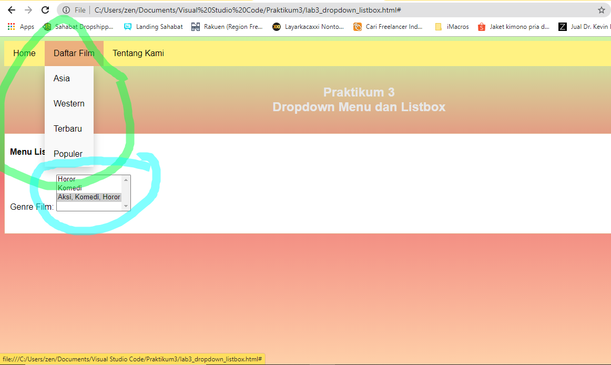
- Lingkar hijau untuk dropdawn menu dan lingkarang biru untuk listbox, source code nya seperti berikut :
- 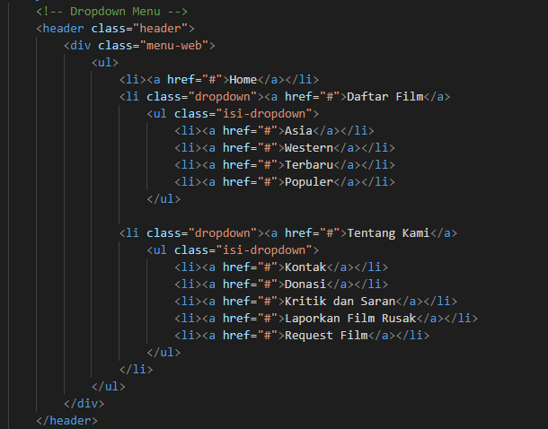
- itu adalah source code untuk dropdawn menu, dan berikut untuk source code listbox :
- 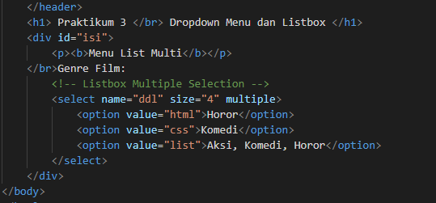

# Praktikum 3 Web List,  Table, dan Form
# List
- Untuk membuat list, seperti biasa kita buat kerangka seperti berikut
- 
- kemudian kita masukan tag ol dan isi variabel list, seperti berikut
- 
- dan ini hasilnya
- 
- setelah itu, kita gunakan tag ul seperti sc berikut
- 
- kemudian list akan bertambah seperti ini
- 
- lalu kita bisa menggunakan tag d1 seperti berikut
- 
- maka hasil dari sc berikut adalah
-  

# Table
- Untuk membuat tabel, kita membuat kerangka seperti biasa
- 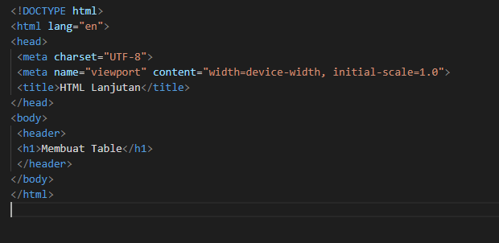
- lalu kita tambahkan isi tabelnya seperti berikut
- 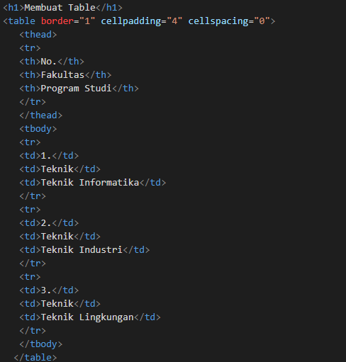
- dan hasilnya akan menjadi seperti ini
- 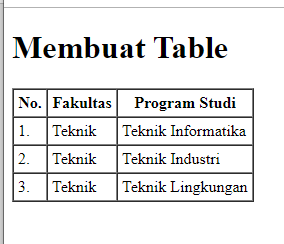
- kemudian kita bisa adjust padding kita agar sesuai, seperti ini
- 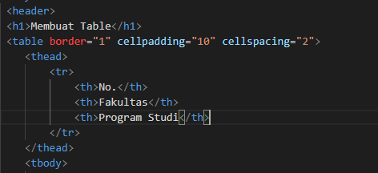
- dan akan menjadi seperti ini
- 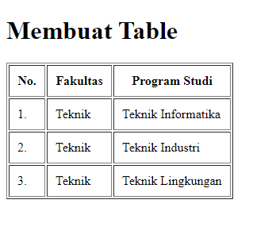
- kemudian kita bisa menambahkan rowspan untuk menggabungkan kolom, seperti berikut
- 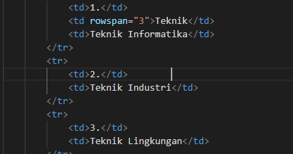
- dan ini adalah hasilnya
- 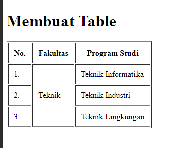

# Form
- Untuk membuat form, kita akan membuat kerangka seperti ini
- 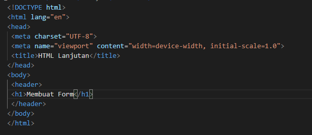
- kemudian kita tambahkan isinya dengan sc berikut
- 
- maka hasilnya akan menjadi berikut 
- 
- setelah itu, kita bisa menambahkan style sesuka kita, contohnya sebagai berikut
- 
- dan hasil akhirnya seperti ini
- 
